# 🌶️ 당신의 협업을 도와줄 오픈소스, 칠리소스

# \***\*🖥 프로젝트 소개\*\***

‘오늘 내 할 일이 뭐였더라?’ 하며 JIRA에 들어가보고, ‘프로젝트 마감이 언제지?’ 하면서 간트차트를 열어보고, ‘팀원이 이 일을 끝냈을까?’ 궁금할 때 일일이 물어보는 것들.. 😮‍💨 너무 불편하셨죠? 이제 저희 칠리소스와 함께 편하게 프로젝트하세요!

- 주요기능
  - JIRA 연동 - 스프린트마다 반복 사용되는 이슈를 빠르게 생성
  - 캘린더 기능 - 어떤 이슈를 언제 진행할지 일정 생성 가능, 팀원과 공유하여 팀원의 스케줄 확인 가능
  - 간트 차트 - 캘린더를 세분화한 기능으로 시간별로 업무 스케줄링 가능
  - GitLab 연동 - Merge Request, Commit 로그 확인
- 주요기술
  - MSA로 설계한 서비스별 모듈화
  - Spring Cloud Feign
  - ELK, Zipkin, Prometheus, Grafana
  - eureka 및 gateway를 활용한 로드밸런싱 및 서비스의 스케줄링
  - JWT Authentication
  - REST API

# \***\*📋 프로젝트 정보\*\***

🔨 프로젝트 개발 환경 및 사용 기술 스택

| 구분          | 종류       | 기술스택           | 버전          |
| ------------- | ---------- | ------------------ | ------------- |
| FE            | IDE        | Visual Studio Code |               |
|               | Language   | typeScript         |               |
|               |            | react              |               |
|               |            | react-router       |               |
|               |            | react query        |               |
|               |            | recoil             |               |
|               |            | tailwind           |               |
| BE            | IDE        | IntelliJ IDE       |               |
|               | Language   | Java JDK           | Zulu 8.33.0.1 |
|               |            | SpringBoot         | 2.7.4         |
|               |            | Spring Data JPA    |               |
|               |            | Spring Validation  |               |
|               |            | QueryDSL           | 5.0.0         |
|               |            | Swagger2           | 3.0.0         |
|               | DB         | MySQL              | 8.0.30        |
|               |            | Redis              | 7.0.4         |
|               |            | S3                 |               |
|               | Build Tool | Gradle             | 7.5.1         |
| Infra         |            | Jenkins            |               |
|               |            | Nginx              |               |
|               |            | Docker             |               |
|               |            | Docker Compose     |               |
|               |            | Elastic Search     |               |
|               |            | Logstash           |               |
|               |            | Kibana             |               |
|               |            | RabbitMQ           |               |
|               |            | Prometheus         |               |
|               |            | Grafana            |               |
|               |            | Zipkin             |               |
| Collaboration |            | GitLab             |               |
|               |            | Jira               |               |
|               |            | Notion             |               |
|               |            | Matermost          |               |
|               |            | Figma              |               |

## \***\*🗂 서비스 아키텍처\*\***

# \***\*🗃 프로젝트 결과물\*\***

### 1. 메인화면

- 랜딩 페이지

  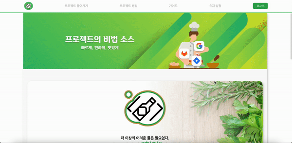

- 서비스 이용 가이드

  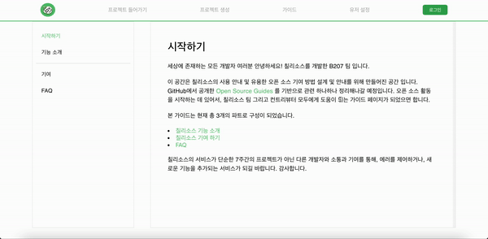

- 소셜 로그인

  

- 유저 정보 수정

  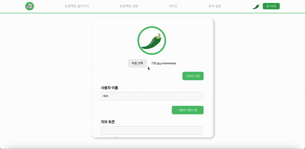

### 2. 프로젝트 생성 후 Jira 또는 GitLab과 선택적으로 연동

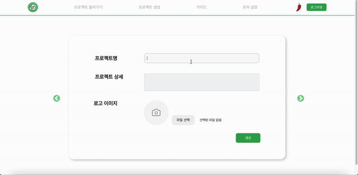

### 3. 원하는 프로젝트 입장 및 설정

- 프로젝트 입장 및 설정

  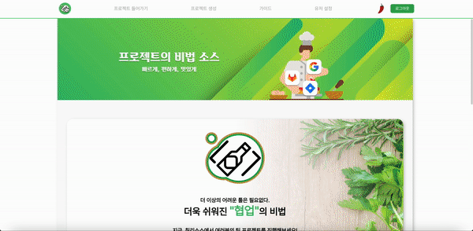

- 팀원 추가 및 권한 변경

  

### 4. 프로젝트 대시보드에서 사용자 별로 원하는 위젯 추가

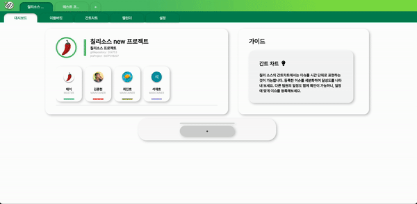

### 5. 미들버킷 탭에서 JIRA의 이슈를 빠르게 생성

- 자주 사용하는 이슈의 내용 틀을 이슈 템플릿으로 저장

  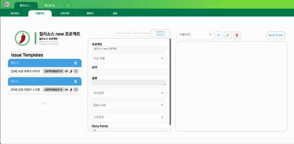

- 이슈 템플릿의 내용을 불러와 미들 버킷에 담기

  

- 미들 버킷에 있는 이슈들을 한꺼번에 Jira의 이슈로 생성

  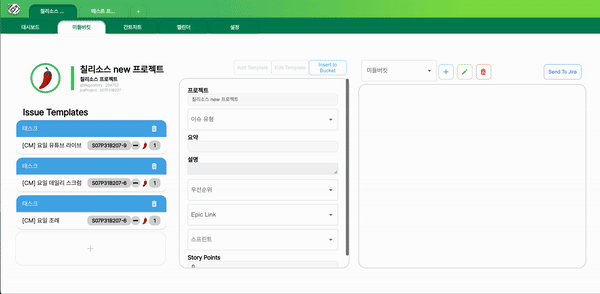

### 6. 캘린더에서 일정 관리

- 다른 팀원의 일정 확인 가능

  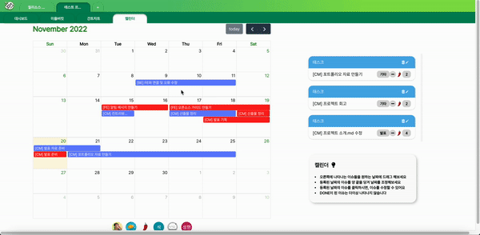

- 나의 일정에 맞게 아직 처리하지 않은 이슈들을 캘린더에 추가

  

- 이슈 수정

  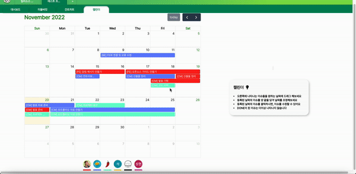

### 7. 간트 차트에서 시간별로 더욱 꼼꼼한 일정 관리

- 시간별/일별/월별/연도별 일정을 한눈에 확인 가능

  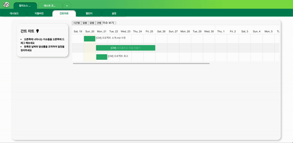

- 시간 단위로 세분화하여 일정 조정

  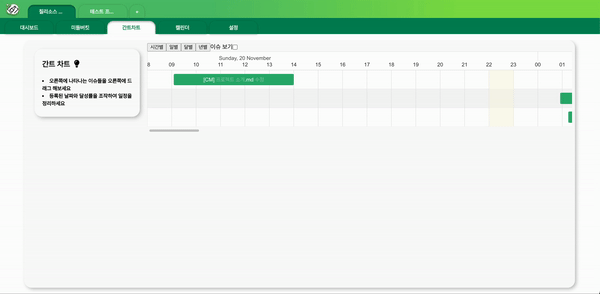

### 8. GitLab의 최근 Merge 내역 조회

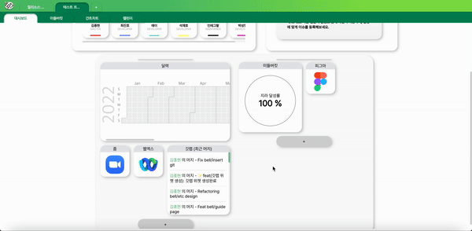

# 📝 \***\*라이센스\*\***

Distributed under the SGPL license. See [License](./LICENSE) for more information.
