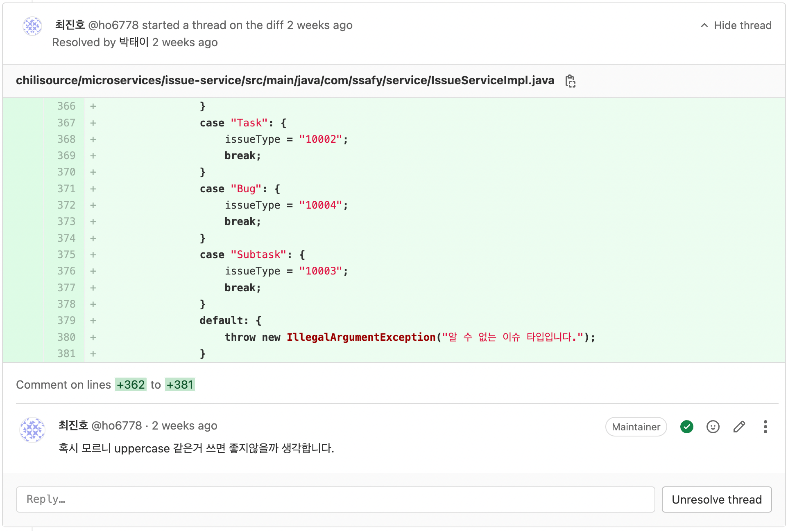

# Git 전략

## Git Flow

- `master` → `release` → `dev` → `FE & BE`

## Branch 생성 방법

- 예시) `feat-inte/router-setting`
- 닉네임
    - bell - 종현
    - gno - 진호
    - inte - 준혁
    - dbcs - 성현
    - ho - 재호
    - ehoi - 태이

## 코드 리뷰

- 공통
    - 다른 2인이 승인해야 머지를 한다.
    - ~~리뷰가 진행이 되며, 수정이 필요한 경우, 수정 후 새롭게 머지를 요청한다. 이전 머지 요청은 취소한다.~~
    - 머지요청 취소 x, 리뷰 후 이를 바탕으로 새롭게 커밋 앤 푸시 그러고 또 리뷰 → 결국 승인!
        
        
        
        - 리뷰이는 수정을 한 후 resolve 버튼을 누릅니다.
    - 머지 요청이 올 때는 최대한 바로바로 리뷰하자.
    - 스크럼 종료 시에 모두 풀을 받아서 해당 `FE`, `BE` , `dev` 가 모두 최신상태가 되도록 하자!
- FE
- BE

## commit 컨벤션

- git cz

## scrum 커밋 시 브랜치 명

ex ) docs-dbcs/221019-scrum