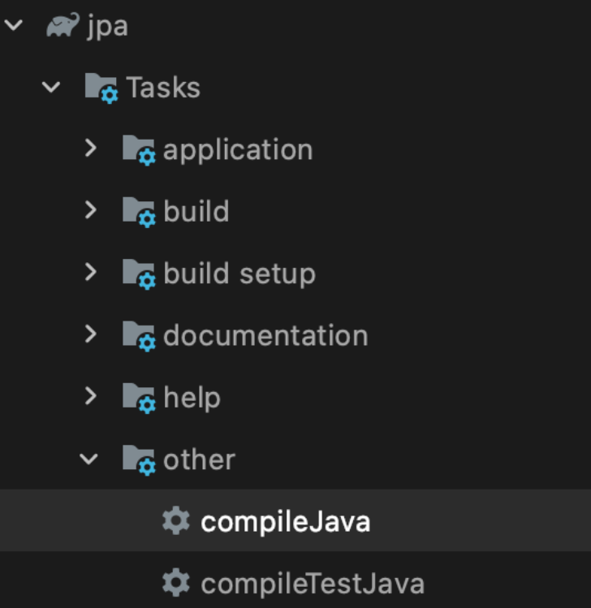

# QueryDSL

[[Querydsl] 기본 문법 - QType, 조건절, 결과 매핑](https://jaime-note.tistory.com/69)

[Attempt to recreate a file for type 에러](https://vesselsdiary.tistory.com/146)

[Spring Boot와 QueryDSL 연동하기](https://velog.io/@woo0_hooo/Spring-Boot%EC%99%80-QueryDSL-%EC%97%B0%EB%8F%99%ED%95%98%EA%B8%B0)

# JPQL

- Spring Data JPA가 기본적으로 제공해주는 CRUD 메서드 및 쿼리 메서드를 사용하더라도, 원하는 조건의 데이터를 가져오기 위해서 직접 쿼리를 짜야할 때가 있다.
- 그럴 때 JPQL을 작성하게 되는데, 간단한 로직이라면 문제가 없으나 복잡한 로직일 경우 쿼리 문자열이 상당히 길어진다.
- 게다가 오타나 문법적 오류가 있다면, 동적쿼리일 시에는 런타임 시점에 에러가 발생한다. (정적 쿼리에서 오류가 있다면 어플리케이션을 로딩할 때 발견 가능하긴 함)

→ 그래서 사용하는 게 QueryDSL이다.

# QueryDSL

- 정적 타입을 이용해서 쿼리를 작성해주는 프레임워크이다.
- 장점을 알아보자
    1. 문자가 아닌 코드로 쿼리를 작성하기 때문에 컴파일 시점에 오류를 파악할 수 있다.
    2. 자동 완성 등 IDE의 도움을 받을 수 있다.
    3. 동적인 쿼리 작성 또한 편리하다.
    4. 쿼리 작성시 제약 조건 등은 메서드로 추출해서 재사용할 수 있다.

# 실전

## 1. 설정 후 빌드

참고 : gradle 버전이나 IntelliJ 버전에 따라 QueryDSL 설정이 상이하기 때문에 다른 환경에서는 동작하지 않을 수도 있다.

> build.gradle
> 

빨간색 글씨에는 QueryDSL 버전이 들어간다.

```
dependencies {
	// QueryDSL
	implementation 'com.querydsl:querydsl-jpa:5.0.0'
	annotationProcessor(
			"javax.persistence:javax.persistence-api",
			"javax.annotation:javax.annotation-api",
			'com.querydsl:querydsl-apt:5.0.0:jpa')
}

// QueryDSL
sourceSets {
	main {
		java {
			srcDirs = ["$projectDir/src/main/java", "$projectDir/build/generated"]
		}
	}
}
```

- QueryDSL은 프로젝트 내의 @Entity 어노테이션이 선언된 클래스를 탐색하고 `JPAAnnotationProcessor` 를 사용해 Q클래스를 생성한다.
    - Q클래스란?
- `querydsl-apt`가 @Entity와 @Id 등의 어노테이션을 알 수 있도록, `javax.persistence` 와 `javax.annotation` 을 `annotationProcessor`에 함께 추가한다.
    - `annotationProcessor`는 Java 컴파일러 플러그인으로써, 컴파일 단계에서 어노테이션을 분석하여 추가적인 파일을 생성할 수 있다.
- Q클래스는 generated 디렉토리에 생성되는데 이를 sourceSet에 추가한다.
    - IDE에서 Q클래스 파일에 접근하기 위해서는 generated를 확인하면 된다.

## 2. 컴파일




- `$projectDir/build/generated` 디렉토리 하위에 Entity로 등록된 클래스의 이름앞에 Q가 붙은 형태로 `Q클래스`가 생성된 것을 볼 수 있다.
- QueryDSL로 쿼리를 작성할 때, Q클래스를 사용함으로써 쿼리를 Type-Safe하게 작성할 수 있다

## 3. 이 쯤에서 JPQL과 QueryDSL을 비교해보자

1. JPQL로 작성하는 경우
    
    ```java
    @DisplayName("hi 내용을 포함하며 댓글이 1개 이상인 Post를 조회한다.")
    @Test
    void jpa_findPostsByMyCriteria_Three() {
        EntityManager entityManager = testEntityManager.getEntityManager();
    
        List<Post> posts = entityManager.createQuery("select p from Post p where p.content like '%hi%' and p.comments.size > 0 order by p.id desc", Post.class)
            .getResultList();
    
        assertThat(posts).hasSize(3);
    }
    ```
    
    - 정적 쿼리가 아닌 관계로 문법 오류가 발생하면 어플리케이션 로딩 시점에서 이를 감지하지 못하고, 런타임 에러가 발생한다.
    - Post.class 지네릭 타입을 파라미터로 제공하지 않으면, raw 타입의 리스트가 반환된다.
2. QueryDSL로 작성하는 경우
    
    ```java
    @DisplayName("hi 내용을 포함하며 댓글이 1개 이상인 Post를 ID 내림차순으로 조회한다.")
    @Test
    void queryDsl_findPostsByMyCriteria_Three() {
        EntityManager entityManager = testEntityManager.getEntityManager();
    
        JPAQuery<Post> query = new JPAQuery<>(entityManager);
        QPost qPost = new QPost("p");
    
        List<Post> posts = query.from(qPost)
            .where(qPost.content.contains("hi")
                .and(qPost.comments.size().gt(0))
            ).orderBy(qPost.id.desc())
            .fetch();
    
        assertThat(posts).hasSize(3);
    }
    ```
    
    - 반면 QueryDSL은 각종 풍부한 체이닝 메서드 + 유틸리티 메서드 + 정적 타입(Q클래스)을 기반으로 직관적으로 쿼리를 작성한다.
    - 아래의 경우는 join을 할 때이다.
        
        ```java
        @DisplayName("QueryDsl을 통해 Post 조회시 Comment를 Fetch Join한다.")
        @Test
        void queryDsl_FetchJoinComments_Success() {
            EntityManager entityManager = testEntityManager.getEntityManager();
        
            JPAQuery<Post> query = new JPAQuery<>(entityManager);
            QPost qPost = new QPost("p");
            QComment qComment = new QComment("c");
        
            List<Post> posts = query.distinct()
                .from(qPost)
                .leftJoin(qPost.comments, qComment).fetchJoin()
                .fetch();
        
            assertThat(posts).hasSize(3);
        }
        ```
        
    

## 4. Repository에서 QueryDSL 사용하기

<aside>
📝 Spring Data JPA는 JpaRepository를 상속한 Repository에서 CustomRepository를 만들 수 있는 기능을 제공한다.

</aside>

### 4-0. PostRepository (기존)

다음의 JPQL을 바꿔보도록 하자

```java
public interface PostRepository extends JpaRepository<Post, Long> {

    @Query("select p from Post p join fetch p.comments")
    List<Post> findAllInnerFetchJoin();

    @Query("select distinct p from Post p join fetch p.comments")
    List<Post> findAllInnerFetchJoinWithDistinct();

    //...
}
```

### 4-1. QueryDslConfig

```java
@Configuration
public class QueryDslConfig {

    @PersistenceContext
    private EntityManager entityManager;

    @Bean
    public JPAQueryFactory jpaQueryFactory() {
        return new JPAQueryFactory(entityManager);
    }
}
```

- JpaQueryFactory를 Bean으로 등록하여 프로젝트 전역에서 QueryDSL를 작성할 수 있도록 한다.

### 4-2. PostCustomRepository

```java
public interface PostCustomRepository {

    List<Post> findAllInnerFetchJoin();

    List<Post> findAllInnerFetchJoinWithDistinct();
}
```

- 3-0의 PostRepository 인터페이스에 있던 메서드를 삭제하고, 동일한 메서드를 `PostCustomRepository`를 생성하여 여기에 정의한다.

### 4-3. PostCustomRepositoryImpl

```java
import static com.learning.jpa.domain.post.QPost.post;

@Repository
public class PostCustomRepositoryImpl implements PostCustomRepository {

    private final JPAQueryFactory jpaQueryFactory;

    public PostCustomRepositoryImpl(JPAQueryFactory jpaQueryFactory) {
        this.jpaQueryFactory = jpaQueryFactory;
    }

    @Override
    public List<Post> findAllInnerFetchJoin() {
        return jpaQueryFactory.selectFrom(post)
            .innerJoin(post.comments)
            .fetchJoin()
            .fetch();
    }

    @Override
    public List<Post> findAllInnerFetchJoinWithDistinct() {
        return jpaQueryFactory.selectFrom(post)
            .distinct()
            .innerJoin(post.comments)
            .fetchJoin()
            .fetch();    
    }
}
```

- `PostCustomRepository` 를 구현하는 `PostCustomRepositoryImpl` 클래스에 QueryDSL 쿼리를 작성한다.
    - (중요) 이 때, 해당 구현 클래스 이름은 반드시 Impl로 끝나야 한다.
- 3번에서 테스트를 할 때 작성한 코드에서는 Qpost와 같은 Q 타입 인스턴스를 직접 생성해서 사용했지만
    
     이번에는 QPost를 static import 함으로써 QPost에 미리 정의된 Q타입 인스턴스 상수를 사용한다.
    
    실제로 QPost 클래스 내부에는 Q타입의 인스턴스 상수들이 이미 정의되어 있음을 볼 수 있다.
    
    (Generated 이하로 가서 직접 확인해보기)
    

### 4-4. PostRepository

- 여기에는 3-2에서 JPQL 쿼리는 모두 삭제된 상태일 것이다.
- 그리고 JpaRepository는 당연히 상속하고 있을 것이다.
- 이제 `PostCustomRepository 인터페이스도 상속`하게 하자
    - 그러면 PostCustomRepositoryImpl에 작성된 QueryDSL 코드를 PostRepository에서 자동으로 사용할 수 있게 된다.

```java
public interface PostRepository extends JpaRepository<Post, Long>, PostCustomRepository {

}
```

### 4-5. 기타

- 원한다면 특정 엔티티 타입에 구애받지 않는 자신만의 QuerDSL 관련 Repository를 정의해 사용할 수도 있다.

```java
@Repository
public class QueryRepository {

    private final JPAQueryFactory jpaQueryFactory;

    public QueryRepository(JPAQueryFactory jpaQueryFactory) {
        this.jpaQueryFactory = jpaQueryFactory;
    }

    public List<Post> findAllPostsInnerFetchJoin() {
        return jpaQueryFactory.selectFrom(post)
            .innerJoin(post.comments)
            .fetchJoin()
            .fetch();
    }

    public List<Orphan> findALlOrphans() {
        return jpaQueryFactory.selectFrom(orphan)
            .distinct()
            .leftJoin(orphan.parent).fetchJoin()
            .where(orphan.name.contains("abc"))
            .fetch();
    }
}
```

# 출처

[Spring Boot에 QueryDSL을 사용해보자](https://tecoble.techcourse.co.kr/post/2021-08-08-basic-querydsl/)